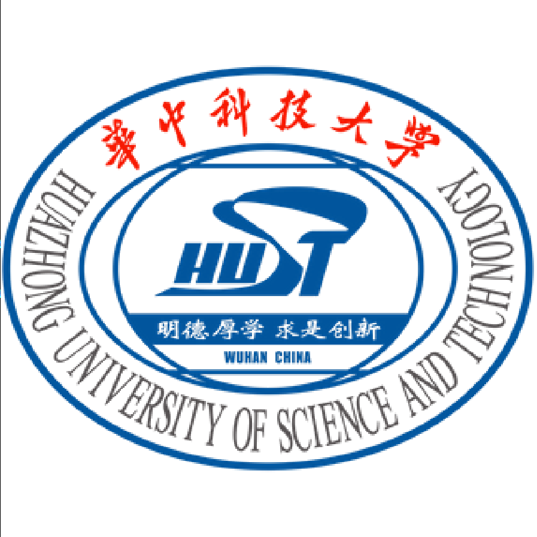

<h1 align="center"> Hello! 👋  I'm Zhengzhuo Xu (许正卓) </h1>

 

# Recently

My research interests 🔎 are in Computer Vision, including but not limited to <u>imbalanced data learning</u> / <u>3D recognization</u>. Contact me via  ✉️  <u>xzzthu@gmail.com</u>. 

<!-- Here is my resume of [[English Version]](../files/resume/resume_xzz_en.pdf) and [[Chinese Version]](../files/resume/resume_xzz_cn.pdf)! -->

Research Intern 💼
======
- 2022.11 - Now  
[IDEA](https://idea.edu.cn/) supervised by *Dr*. [Haiqin Yang](https://hqyang.github.io/) and focus on Long-Tailed Recognition.
- 2021.07 - 2022.07  
[Tencent AI lab](https://ai.tencent.com/ailab/zh/index/) supervised by *Dr*. [Linchao Bao](https://linchaobao.github.io/) and focus on 3D Reconstruction / Style Transfer.
- 2019.12 - 2020.06  
[Ping An Tech](https://tech.pingan.com/) supervised by *Dr*. [Haiqin Yang](https://hqyang.github.io/) and focus on Data Mining.

Education 🎓
======

  <ul>
  <li>2020.09 - Today </li>
  Ph.D Candidate at <a href="https://www.sigs.tsinghua.edu.cn/">SIGS</a>, <a href="https://www.tsinghua.edu.cn/">Tsinghua University</a>, supervised by <i>Prof</i>. <a href="https://www.sigs.tsinghua.edu.cn/yc2/main.htm">Chun Yuan</a> and focus on Long-tailed Data Mining.  
  GPA: <b>3.89</b>/4.00
  </ul>
  

  <ul>
  <li>2017.07 - 2017.09 </li>
Short-term exchange at <a href="https://www.oriel.ox.ac.uk">Oriel College</a>, <a href="https://www.ox.ac.uk/cn">Oxford</a>.
  </ul>
  

  <ul>
  <li>2016.09 - 2020.06 </li>
  Receive the Bachelor degree of Electrical Engineering in <a href="http://qiming.hust.edu.cn/">Qiming College</a>, <a href="http://ei.hust.edu.cn/">EIC</a>, <a href="https://www.hust.edu.cn/">HUST</a>.  
  Weighted score: <b>88.84</b>/100 (Top <b>3</b>%)
  </ul>
  

Publication 📄 
======
- *Learning Imbalanced Data with Vision Transformers*  
**Zhengzhuo Xu**, Ruikang Liu, Shuo Yang, Zenghao Chai, Chun Yuan  
**CVPR**, 2023. [[Arxiv](https://arxiv.org/abs/2212.02015)] [[Code](https://github.com/XuZhengzhuo/LiVT)] [[PDF](./files/papers/LiVT.pdf)]

- *Rethink Long-tailed Recognition with Vision Transforms*  
**Zhengzhuo Xu**\*, Shuo Yang\*, Xingjun Wang, Chun Yuan  
**ICASSP**，2023. [[Arxiv](https://arxiv.org/abs/2302.14284)] [Code to release] [[PDF](./files/papers/PDC.pdf)]

- *HHF: Hashing-guided Hinge Function for Deep Hashing Retrieval*  
Chengyin Xu\*, **Zhengzhuo Xu**\*, Zenghao Chai\*, Hongjia Li, Qiruyi Zuo, Lingyu Yang, Chun Yuan  
**IEEE TMM**. [[Arxiv](https://arxiv.org/abs/2112.02225)] [[IEEE](https://ieeexplore.ieee.org/document/9953581)] [[Code](https://github.com/JerryXu0129/HHF)]

- *REALY: Rethinking the Evaluation of 3D Face Reconstruction*  
Zenghao Chai\*, Haoxian Zhang\*, Jing Ren, Di Kang, **Zhengzhuo Xu**, Xuefei Zhe, Chun Yuan, Linchao Bao  
**ECCV**, 2022. [[Arxiv](https://arxiv.org/abs/2203.09729)] [[Page](https://www.realy3dface.com/)] [[Code](https://github.com/czh-98/REALY)] [[PDF](./files/papers/Realy.pdf)]

- *Semantic-Sparse Colorization Network for Deep Exemplar-based Colorization*  
Yunpeng Bai, Chao Dong, Zenghao Chai, Andong Wang, **Zhengzhuo Xu**, Chun Yuan  
**ECCV**, 2022. [[Arxiv](https://arxiv.org/abs/2112.01335)] [[Code](https://github.com/bbaaii/SSC-Net)] [[PDF](./files/papers/SSCN.pdf)] 

- *HyP2 Loss: Beyond Hypersphere Metric Space for Multi-label Image Retrieval*  
Chengyin Xu, Zenghao Chai, **Zhengzhuo Xu**, Chun Yuan, Yanbo Fan, Jue Wang  
**ACM MM**, 2022. [[Arxiv](https://arxiv.org/abs/2208.06866)] [[Code](https://github.com/JerryXu0129/HyP2-Loss/)] [[PDF](./files/papers/Hpy_loss.pdf)] 

- *CMS-LSTM: Context Embedding and Multi-Scale Spatiotemporal Expression LSTM for Predictive Learning*  
Zenghao Chai, **Zhengzhuo Xu**, Yunpeng Bai, Zhihui Lin, Chun Yuan  
**ICME**, 2022. [[Arxiv](https://arxiv.org/abs/2102.03586)] [[Code](https://github.com/czh-98/CMS-LSTM)] [[PDF](./files/papers/CMS-LSTM.pdf)]

- *MoDeRNN: Towards Fine-grained Motion Details for Spatiotemporal Predictive Learning*  
Zenghao Chai, **Zhengzhuo Xu**, Chun Yuan  
**ICASSP**, 2022. [[Arxiv](https://arxiv.org/abs/2110.12978)] [[Code](https://github.com/czh-98/MoDeRNN)] [[PDF](./files/papers/MoDeRNN.pdf)]

- *Towards Calibrated Model for Long-Tailed Visual Recognition from Prior Perspective*  
**Zhengzhuo Xu**\*, Zenghao Chai\*, Chun Yuan  
**NeurIPS**, 2021. [[Arxiv](https://arxiv.org/abs/2111.03874)] [[OpenReview](https://openreview.net/forum?id=vqzAfN-BoA_)] [[Code](https://github.com/XuZhengzhuo/Prior-LT)] [[PDF](./files/papers/Prior_LT.pdf)] [[Supplementary Material](./files/papers/Prior_Supplementary_Material.pdf)]

- *Backscatter-assisted computation offloading for energy harvesting IoT devices via policy-based deep reinforcement learning*  
Yutong Xie, **Zhengzhuo Xu**, Yuxing Zhong, Jing Xu, Shimin Gong, Yi Wang  
**IEEE/CIC ICCC Workshops**, 2019. [[IEEE](https://ieeexplore.ieee.org/abstract/document/8849964)] [[PDF](./files/papers/Backscatter_DDPG.pdf)]

- *Backscatter-assisted hybrid relaying strategy for wireless powered IoT communications*  
Yutong Xie, **Zhengzhuo Xu**, Shimin Gong, Jing Xu, Dinh Thai Hoang, Dusit Niyato  
**IEEE GLOBECOM**, 2019. [[IEEE](https://ieeexplore.ieee.org/abstract/document/9013386)] [[PDF](./files/papers/Backscatter_Hybrid_Relaying.pdf)]

- *Backscatter-aided hybrid data offloading for mobile edge computing via deep reinforcement learning*  
Yutong Xie, **Zhengzhuo Xu**, Jing Xu, Shimin Gong, Yi Wang  
**MLICOM**, 2019. [[Springer](https://link.springer.com/chapter/10.1007/978-3-030-32388-2_45)]

Patent 🧾
======
- A Lightweight Fine-grained Spatiotemporal Predictive Method and System.  
Chun Yuan, Zenghao Chai, **Zhengzhuo Xu**.  
Invention patent, CN114445463A.

- A Method for Obtaining Interpretability Parameters of Deep Learning Models.  
**Zhengzhuo Xu**, Haiqin Yang.  
Invention patent, CN112052957A.

Awards 🌟
======
- Tsinghua Friend JiuJiang Scholarship (TOP 5%)
- Excellent Students of QiMing College (best honor of HUST, TOP 1%)
- HaiHang Scholarship (TOP 1%)
- Outstanding Undergraduate Graduates of HUST (TOP 5%)
- First Class Scholarship of HUST (3 times, TOP 10%)
- New Student Scholarship of HUST (TOP 30%)

Project 🔨
======
- China Collegiate Computing Contest ([CCCC](http://www.appcontest.net/)) 2019.  
Second class prize in the **FINAL** [[App](https://appsuke.com/cn/%E8%A7%86%E5%94%B1%E8%BE%BE%E4%BA%BA/)] available at Apple Store [[Present Video](https://youtu.be/ACqSiaio98s)]
- Rubik’s Cube Robot Design.  
An automatic cube solving robot via visual recognization and stepper motor [[Demo Video](https://youtu.be/lwa5qByJMJc)]
- BeiBei Seed Cup Competition 2017.  
Rank **11**/1000 [[Code](https://github.com/Dedsec-Xu/Seed_Cup_TextCNN)]
- Music Visualizer Circut  
A hardware circuit which uses LEDs and a power amplifier (LM386) to visualize music (low, medium and high frequence bandwidth) [[Demo Video](https://youtu.be/e310kDNNbSg)]
- Digital Signal Processing Course Design.  
A electronic piano simulator[[Code](https://github.com/byrrice/Matlab-Final-Project)]

Leadership 🔭 
======
- Outstanding annual member of the branch committee for post-graduate from Dept. of SIGS, Tsinghua.
- Commissary in charge of organization, the Party branch for post-graduate from the Dept. of SIGS, Tsinghua.
- Person in charge the Dept. of Club, Students' Association Union of Huazhong University of Science and Technology.

